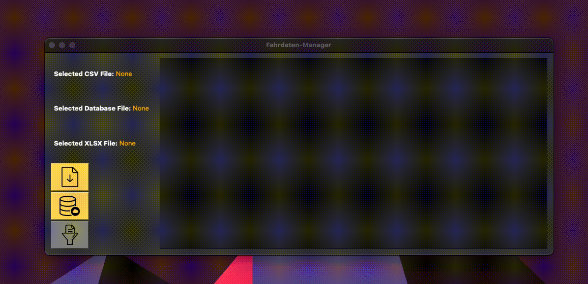

# Fahrdaten-Manager
[Lesen Sie dieses Dokument auf Deutsch](docs/ger.md)


Fahrdaten-Manager is a Python-based tool for importing and processing vehicle trip data stored in CSV format, managing this data within a SQLite database, and exporting it to an XLSX file for further analysis.

## Features

- Load data from CSV files.
- Create and update SQLite tables for each vehicle.
- Check for existing entries and update records if necessary.
- Export data to XLSX format, with individual sheets per vehicle.

## Requirements

- Python 3.x
- pandas
- sqlite3
- PyInquirer
- re (Regular Expression module)

## Installation

1. Ensure Python 3.x is installed on your system.
2. Clone the repository or download the source code.
3. Navigate to the project directory.

## Setting Up a Virtual Environment

Setting up a virtual environment is recommended to avoid conflicts with other packages and versions. To set up and activate a virtual environment:

For **Unix/macOS** systems:

```sh
python3 -m venv venv
source venv/bin/activate
```

For **Windows** systems:

```bat
python -m venv venv
.\venv\Scripts\activate
```

Once the virtual environment is activated, install the required packages:

```sh
pip install -r requirements.txt
```

## Usage

To run the program, use the provided shell script for Unix/macOS or batch file for Windows:

For **Unix/macOS**:

```sh
./run.sh
```

For **Windows**:

```bat
.\run.bat
```

## Usage with GUI

Fahrdaten-Manager comes with a graphical user interface (GUI) for ease of use. To interact with the program, follow these steps:

1. Launch the program by running `run.sh` or `run.bat` script, depending on your operating system.
2. Use the GUI to:
   - Select your CSV file by clicking the "CSV" button.
   - Choose your database file by clicking the "Database" button.
   - After one is selected it will let you choose a XLSX file
   - If a new databse file is created it will create a XLSX file automatically with the same name

Once the files are selected, the program will display the paths to the chosen files on the interface. 

3. Click the "Processing" button to begin processing the data. The GUI will provide feedback on the progress of the operations.



After processing, the SQLite database will be updated, and an XLSX file will be created at the specified location with the processed data.


## How It Works

The script performs several key functions:
- Establishes a connection to a SQLite database.
- Creates tables for each unique vehicle name found in the CSV data.
- Populates these tables with the trip data, ensuring that the latest trip end times are recorded.
- Generates an XLSX file with a sheet for each vehicle, containing the trip data.

## License

This project is licensed under the MIT License - see the LICENSE.md file for details.

